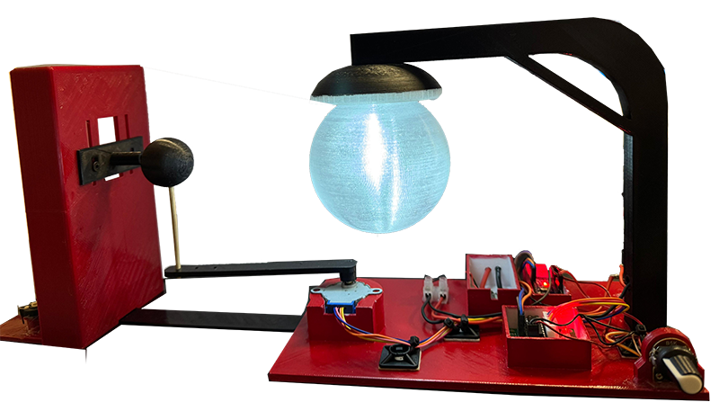

# ArduExoplanet

**ArduExoplanet** is an Arduino-based project designed to simulate the rotation of a planet and to observe light variations using a Light Dependent Resistor (LDR). This project combines 3D-printed components with electronics to create a visually engaging and educational model for understanding planetary motion and light sensing.

---

## Project Overview

### Components

#### Motorized Rotation System:
- **Microcontroller**: Arduino Nano
- **Stepper Motor**: 28BYJ-48 with ULN2003 driver
- **Potentiometer**: 5k Ω
- **On/Off Switch**
- **Power Supply**: 3S LiPo battery with a voltage converter to supply 5V

**Connections:**
- ULN2003 driver inputs connected to D1, D2, D3, and D4 on the Arduino Nano

#### Light Sensing System:
- **Light Dependent Resistor (LDR)**: 5mm
- **Potentiometer**: 20k Ω
- **Microcontroller**: Arduino Nano

**Connections:**
- LDR and potentiometer connected in parallel to the A0 pin on the Arduino Nano

---

## 3D Printing
The 3D printable components for the project can be downloaded from:  
[Thingiverse - ArduExoplanet Model](https://www.thingiverse.com/thing:6888870)

---

## Plotting and Visualization
To visualize and plot data collected by the LDR, you can use the dedicated plotting software:  
[ArduExoplanet Plotter](https://github.com/abrosio/ArduExoplanet_Plotter)

---

## Key Features

- **Stepper Motor Control**: Smooth and precise control of planetary rotation
- **Light Sensing**: Measures light intensity variations using an LDR
- **Battery Powered**: Portable setup powered by a LiPo battery with voltage conversion
- **Customizable Components**: 3D printable parts for integration into the project

---

## Firmware
The Arduino firmware for the stepper motor and light sensing systems is available in this repository. Ensure you have the Arduino IDE installed to upload the firmware to the Arduino Nano.

---

## Usage Instructions

1. **Hardware Setup:**
   - Assemble the 3D-printed parts following the design available on Thingiverse.
   - Connect the electronic components as described in the overview section.
   - Ensure the LiPo battery is charged and connected to the voltage converter.

2. **Firmware Upload:**
   - Open the Arduino IDE.
   - Load the firmware files for the stepper motor and LDR systems.
   - Upload the code to the Arduino Nano.

3. **Run the System:**
   - Turn on the system using the On/Off switch.
   - Use the 5k potentiometer to control the rotation of the stepper motor.
   - Monitor light variations via the LDR system.

---

## Additional Resources

- **3D Printing Files**: [Thingiverse - ArduExoplanet Model](https://www.thingiverse.com/thing:6888870)
- **Plotter Software**: [GitHub - ArduExoplanet Plotter](https://github.com/abrosio/ArduExoplanet_Plotter)

---

## Contributing
Contributions to the project are welcome! Feel free to open an issue or a pull request on this repository to suggest improvements or report problems.

---

© 2024 Antonino Brosio - [www.antoninobrosio.it](https://www.antoninobrosio.it)

Thank you for exploring ArduExoplanet! If you have any questions or suggestions, don't hesitate to reach out.

